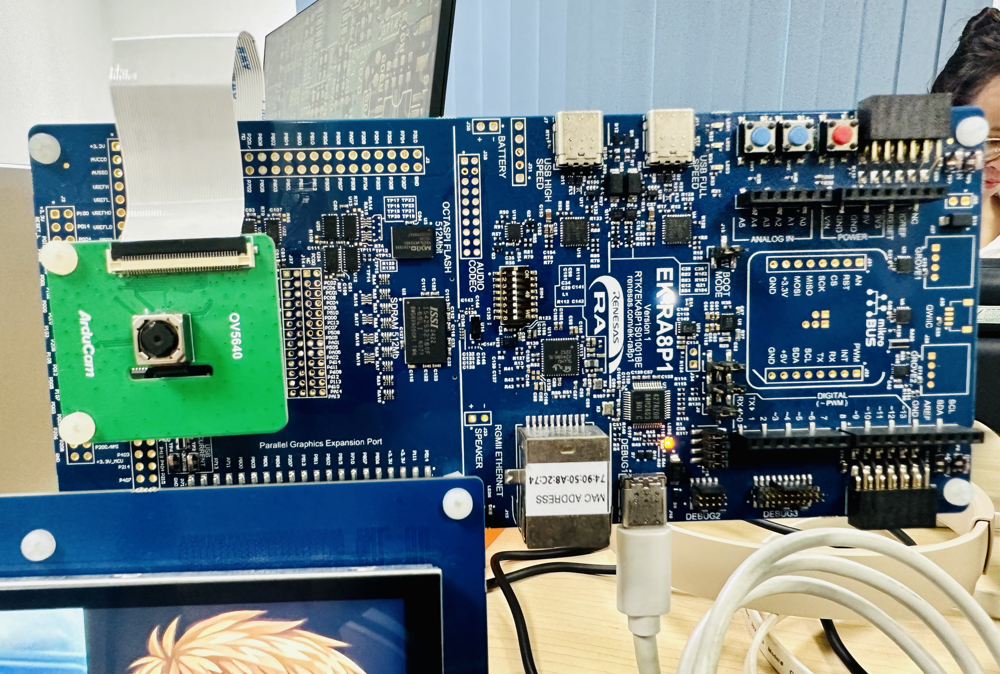
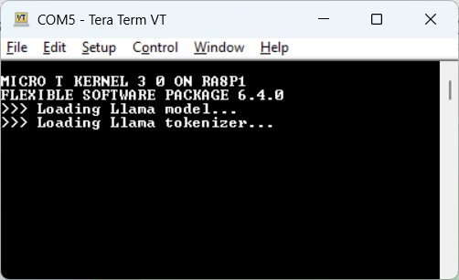
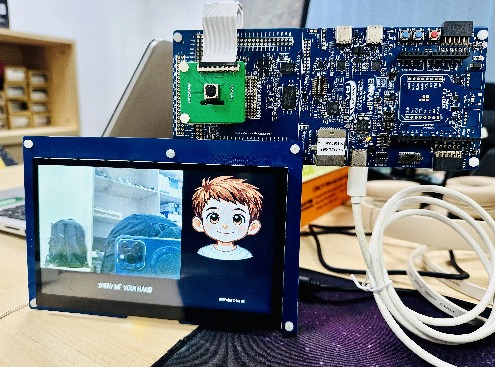
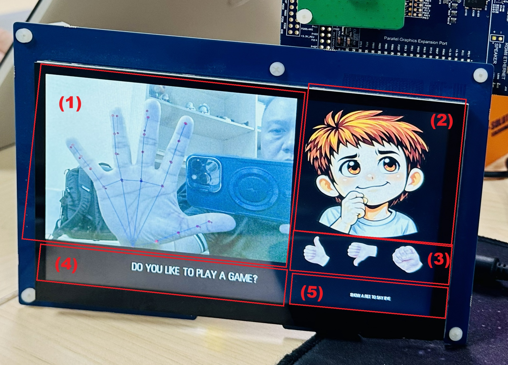
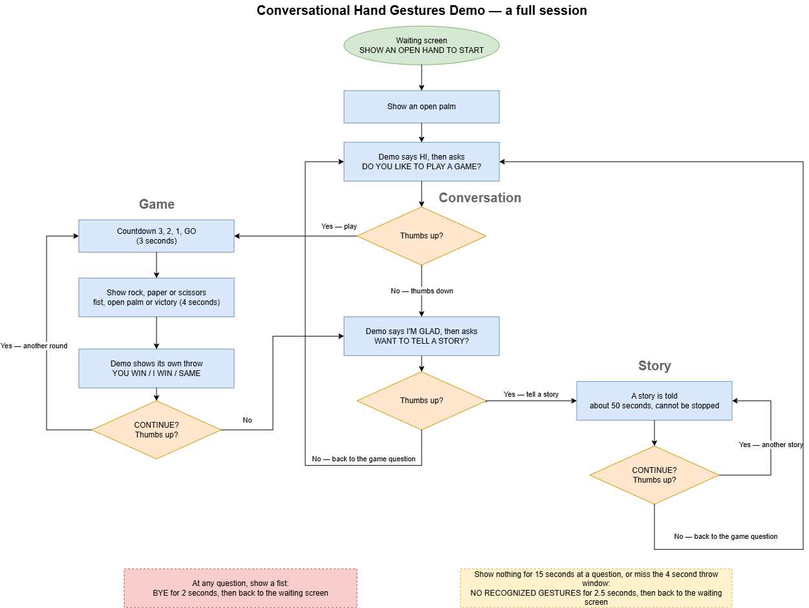

# Conversational Hand Gestures Demo — User Manual

This manual tells you how to set up the board, build the demo, load it, and use it.

It does not explain how the demo works inside. For that, read the application note `hand_gesture_utk_application_note.md`.

---

## 1. What you need

### Hardware

| Item | Detail |
|---|---|
| Board | EK-RA8P1 evaluation kit (RTK7EKA8P1S01001BE) |
| Camera | Camera Expansion Board part number (Arducam) (CU450_OV5640) |
| Display | Parallel Graphics Expansion Board 1 (RTKLCDPAR1S00001BE) |
| Cable | One USB cable to the on-board debug port |

### Software

Install all four before you start.

| Item | Version |
|---|---|
| Renesas e² studio | 2026-07 |
| FSP (Flexible Software Package) | 6.4.0 |
| LLVM for Arm (ATfE) | 21.1.1 |
| Serial terminal | TeraTerm v5.7.0 |

### The project source

| Item | Detail |
|---|---|
| Repository | <https://github.com/gnomons-labs/conversational-hand-gestures-demo> |
| Project folder | `src/hand_gesture_utk` |
| Branch | `main` |

Clone it, or download it as a ZIP and unpack it, before you start section 4. Section 4 imports the `hand_gesture_utk` folder from this repository.

---

## 2. Set up the board



Do these steps with the power off.

1. Fit the camera module to the camera connector on the graphics expansion port. Push the flat cable fully in.
2. Plug the display board into the Parallel Graphics Expansion Port socket below it. It has no cable. Press it straight down until it is fully seated.
3. Check both once more. The camera flat cable must be pushed fully in, and the display board must sit fully down in its socket. A loose camera cable gives a black camera picture. A display board that is not fully in gives a blank screen.
4. Set configuration switch **SW4** as in section 2.1.
5. Plug the USB cable into the **debug port**, connector **J10**, labelled `DEBUG1`. The same cable gives power and carries the serial console.

### 2.1 Required switch settings

SW4 is the 8-way DIP switch near the middle of the board. The demo needs **all eight positions OFF**, which is the factory default.

The word **ON** is printed on one side of the switch body. A lever pushed to that side is ON. A lever pushed to the other side is OFF. So all eight levers must point away from the **ON** mark.

| Position | Switch name | Required |
|---|---|---|
| SW4-1 | Pmod 1 Mode Select 1 | **OFF** |
| SW4-2 | Pmod 1 Mode Select 2 | **OFF** |
| SW4-3 | Octo-SPI Select | **OFF** |
| SW4-4 | Arduino Select | **OFF** |
| SW4-5 | I2C/I3C Select | **OFF** |
| SW4-6 | Camera and Display Mode Select | **OFF** |
| SW4-7 | USBFS Role Toggle | **OFF** |
| SW4-8 | USBHS Role Toggle | **OFF** |

### 2.2 Required jumper settings

Check the jumper settings against below table. If any one is different, set it back to the value in the table.

| Item | Required |
|---|---|
| J16 | Jumper on pins **2-3** |
| J6 | Jumper on pins **2-3** |
| J8 | Jumper on pins **1-2** |
| J9 | Jumper on pins **2-3** |
| J29 | Jumpers on pins **1-2**, **3-4**, **5-6**, **7-8**. All four are needed |

Source for both tables: EK-RA8P1 v1 User's Manual (R20UT5309EG0104), §4.3.3 Table 2 page 13 and §4.3.4 Table 3 page 16. The four J29 jumpers are in §5.2.1 Table 8 page 22.

---

## 3. Open the serial terminal with TeraTerm

**Do this before you download.** If you connect afterwards, you miss the start-up messages.

These steps are for TeraTerm v5.7.0.

### 3.1 Find the port

Plug only the EK-RA8P1 into the PC. Unplug every other board, debug probe and USB-serial adapter first. Then only one J-Link port can be selected.

The board makes one virtual COM port over the same debug cable. In Windows Device Manager, open **Ports (COM & LPT)** and look for **JLink CDC UART Port (COMx)**. Write down the number.

If you see no such port, the debug cable is in the wrong connector or the J-Link driver is not installed.

### 3.2 Connect

1. Start TeraTerm.
2. The **New connection** window opens. Choose **Serial**.
3. In the **Port** list, pick the `COMx: JLink CDC UART Port (COMx)` you found above.
4. Click **OK** to close the window.
5. Check the title bar. It shows the port name when the port is open. If TeraTerm shows an error instead, the port is open in another program.

> **Note:** If the port will not open, try this in order. First close any other TeraTerm window, SEGGER RTT Viewer, Renesas Flash Programmer, and any running e² studio debug session. Try again. If it still fails, unplug the USB cable, wait five seconds, and plug it back in. Then look up the port number in Device Manager again, because it can change.

### 3.3 Set the port

1. Choose **Setup → Serial port...**
2. Set these values:

| Field | Value |
|---|---|
| Speed / Baud rate | **230400** |
| Data | **8 bit** |
| Parity | **none** |
| Stop bits | **1 bit** |
| Flow control | **none** |

3. Click **OK**.

### 3.4 Set the terminal

1. Choose **Setup → Terminal...**
2. Set these values:

| Field | Value |
|---|---|
| Terminal size | **120 x 40** or larger |
| New-line, Receive | **AUTO** |
| New-line, Transmit | **CR** |
| Local echo | **off** (unticked) |
| Coding, receive | **UTF-8** |

3. Click **OK**.

### 3.5 Keep the settings

Choose **Setup → Save setup...** and save over `TERATERM.INI`. Next time, TeraTerm opens with the right speed and you only pick the port.

### 3.6 Optional: keep a log

Choose **File → Log...**, pick a file name, and tick **Timestamp**. This is useful when you want to report a problem, because the start-up messages and the token rate line are written to the file.

---

## 4. Build the demo

1. Start e² studio.
2. Choose **File → Import → Existing Projects into Workspace**.
3. Select the `hand_gesture_utk` project folder and import it. It is under `src/` in the repository named in section 1.
4. Open `configuration.xml`. This opens the RA Configuration editor.
5. Click **Generate Project Content**.

   > **Note:** In the RA Configuration editor, on the **Stacks** tab, you now see three errors on the D/AVE 2D Port Interface stack (`r_drw`). All three ask for a BSP heap:
   >
   > ```
   > D/AVE 2D Port Interface (r_drw): For AzureRTOS application, BSP heap is required under 'BSP | RA COMMON | HEAP SIZE'.
   > D/AVE 2D Port Interface (r_drw): For BareMetal application, BSP heap is required under 'BSP | RA COMMON | HEAP SIZE'.
   > D/AVE 2D Port Interface (r_drw): For FreeRTOS application, either BSP heap or thread heap is required.
   > ```
   >
   > **These three are harmless and expected.** They cover three cases: AzureRTOS, bare metal (no RTOS at all) and FreeRTOS. This demo runs on µT-Kernel, which is none of the three, so none of the three checks applies to it. Ignore them and go on.

6. Set the active build configuration to **Debug**.
7. Build.

A good build ends with `Build Finished. 0 errors`.

---

## 5. Download and run

1. Start the download with the project's **Debug** launch configuration. It uses J-Link over SWD, and targets CPU0.
2. Wait for the download to finish.
3. Press **Resume**.

The download is usually quick. It only programs the external flash when its contents have changed.

---

## 6. Check that it started

Watch the terminal. The first line is:

```
MICRO T KERNEL 3 0 ON RA8P1
```

The FSP version follows. The same text appears at the bottom of the panel.


After about two seconds the waiting screen appears:

- Live camera picture on the left.
- Cartoon face on the right.
- `SHOW AN OPEN HAND TO START` in the text strip at the bottom.

The demo is now ready.



---

## 7. Use the demo

This demo turns an EK-RA8P1 board with a camera and display into a conversational hand-gesture smart toy. A live camera feed with hand-skeleton overlay sits next to an animated cartoon face; the system recognizes five hand shapes (open palm, fist, victory, thumbs up, thumbs down) to drive an interaction loop where an user can greet it, play a round of rock-paper-scissors game against the device, or have it tell a short AI generated story — all controlled by showing hand gestures, with no keyboard or touch input.

### The screen

| Area | What it shows |
|---|---|
| (1) Left | Live camera picture. Red dots and blue lines appear on your hand |
| (2) Right, top | Cartoon face, or the demo's own throw during a game |
| (3) Right, middle | Small pictures of the hand shapes the demo is waiting for |
| (4) Bottom, wide | What the demo is saying, or the story text |
| (5) Bottom, right | `CONTINUE?` and the quit hint |



### The five hand shapes

| Shape | How to make it | What it means |
|---|---|---|
| ✋ Open palm | All four fingers straight | Start the conversation. Also **Paper** in the game |
| ✊ Fist | All four fingers curled, thumb folded in | Say goodbye. Also **Rock** in the game |
| ✌️ Victory | Index and middle straight and apart, other two curled | **Scissors** in the game |
| 👍 Thumbs up | Four fingers curled, thumb out and pointing up | **Yes** |
| 👎 Thumbs down | Four fingers curled, thumb out and pointing down | **No** |

### How to show a gesture

1. Hold your hand in front of the camera, about arm's length away.
2. **Hold it still for about one second.** The demo needs three matching readings in a row, over at least 0.6 seconds. A quick flash of the hand does not count.
3. **Lower your hand between answers.** The demo ignores a shape that you were already holding when the question appeared. This stops one held hand from answering two questions.

The one exception is thumbs up. If you hold it steadily for about two seconds, it is accepted anyway.

### A full session

1. **Show an open palm.** The demo says `HI`, then asks `DO YOU LIKE TO PLAY A GAME?`
2. **Thumbs up** to play. The demo counts `3`, `2`, `1`, `GO`, one per second.
3. **Show rock, fist or victory** during the throw window. You have four seconds.
4. The demo shows its own throw and the result: `YOU WIN`, `I WIN`, or `SAME`.
5. It asks `CONTINUE?` — thumbs up for another round, thumbs down to move on.
6. **Thumbs down** takes you to `WANT TO TELL A STORY?`
7. **Thumbs up** starts a story. Text appears a few letters at a time, over three lines. A full story takes about 50 seconds. The camera picture keeps moving, but no skeleton is drawn on your hand while a story runs.
8. **Show a fist** at any question to end the session.



### Timing you should expect

| Thing | Time |
|---|---|
| Start-up to the waiting screen | About 2 seconds |
| Time to hold a gesture before it counts | About 1 second |
| Time to wait for response | 15 seconds |
| Rock-paper-scissors throw window | 4 seconds |
| A full 128-word story | About 50 seconds |

If you do not answer within 15 seconds, the demo shows `NO RECOGNIZED GESTURES` and goes back to the waiting screen.

### The three buttons on the board

The board has three small push buttons. Two are blue, one is red.

| Button | Colour | What it does in the demo |
|---|---|---|
| **SW2** | Blue | **Reset application.** Goes straight back to the waiting screen and drops any story in progress. Use this to clear the demo for the next visitor |
| **SW1** | Blue | Turns the gesture tuning overlay on or off. This is a developer aid. Leave it off at a booth |
| **SW3** | Red | **MCU reset.** Restarts the whole board. You do not need this for normal use — it takes about two seconds to come back |

> **Use SW2, not SW3.** SW2 clears the demo in an instant and keeps it running. SW3 reboots the board and makes the visitor wait.

The two blue buttons look the same. Check the silkscreen label next to each one before you press it.

---

## 8. Troubleshooting

| Phenomenon | What to do |
|---|---|
| Nothing on the terminal, and nothing on the screen | Check the USB cable and the power. Then check that the download really finished |
| `STORAGE ERROR - DEMO IS LIMITED` in the bottom right | The external flash did not open. **Check switch SW4-3 is OFF**, and check SW4-1, SW4-4 and SW4-6 are OFF too (section 2.1), then power-cycle and download again |
| Blank screen, but the terminal works | Check the display board is pressed fully down in its socket, not loose and not out (section 2), and check **SW4-6 is OFF** (section 2.1). If both are right, the display or the 2D engine did not start. Rebuild after **Generate Project Content** |
| Terminal text is broken or missing, but the demo runs fine | Wrong terminal settings. Check 230400 baud, 8-N-1, no flow control in **Setup → Serial port...** (section 3.3) |
| Download seems to work, but the board does nothing | In e² studio, choose **Run → Renesas Debug Tools → Renesas Device Partition Manager**. Set **Connection Type** to **SWD**, click **Initialize device**, then download again |
| Camera picture is black | Check the camera flat cable is fully plugged in, not loose and not out (section 2), and check **SW4-6 is OFF** and **SW4-5 is OFF** (section 2.1) |
| Your hand is seen, but no gesture is accepted | Hold the shape for 2-3 seconds longer and more still. Then lower your hand fully and try again |
| No red dots on your hand at all | Move closer, and check the lighting. Normal indoor light is enough; strong backlight is not |

---

## 9. Known limits

- The demo uses only Cortex-M85 core, Cortex-M33 core stays idle.
- A story is capped at 128 words and cannot be interrupted. Wait for it, or press **SW2**.
- The story writes about 2.6 words per second. This is on purpose: the camera and screen keep running while it writes, and that costs speed.
- The demo prints diagnostic messages to the terminal. This is normal and does not mean there is a fault.

---

## Related documents

| Document | What it covers |
|---|---|
| `hand_gesture_utk_application_note.md` | How the demo works, and how to reuse the design |
| [Basic specifications](/Basic-Specs/README.md) | System and hardware architecture |
| [Functional specifications](/Functional-Specs/README.md) | Screen behaviour, states, error handling |
| [Detailed specifications](/Detailed-Specs/README.md) | FSP settings, memory, task design |
| [Test specifications](/Test-Specs/Test-Specs.md) | How the demo is tested |
| EK-RA8P1 v1 User's Manual (R20UT5309EG0104) | Board switches, jumpers and connectors. Configuration switch SW4 is in §4.3.4, Table 3 page 16 and Table 4 page 17. The default jumper positions are in §4.3.3, Table 2 page 13, and the on-board debug jumpers including all four J29 positions are in §5.2.1, Table 8 page 22. The buttons SW1, SW2 and SW3 are in §5.5.2, Table 25 page 32. The Octo-SPI flash is in §6.3, page 35 |
